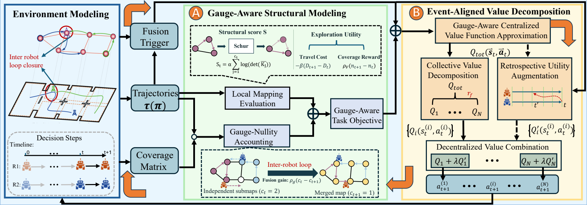

# GEVD

**Gauge-Aware Event-Aligned Value Decomposition for Multi-Robot Active SLAM**

Research code accompanying the manuscript submitted to ICRA 2027. GEVD plans
cooperative region-level routes on a prior topo-metric graph when robot reference
frames are initially unregistered. The method accounts for structural mapping
quality, region coverage, inter-robot fusion, and travel cost.



*GEVD combines gauge-aware structural modeling with event-aligned value
decomposition. The diagram is supplied with the manuscript.*

## Overview

- **Gauge-aware objective.** Representative-pose structural scoring separates
  local mapping quality from the benefit of merging independent robot frames.
- **Shared value decomposition.** A graph-based learner optimizes the joint
  exploration objective with a shared primary value function.
- **Retrospective utility.** An independent, bounded auxiliary branch assigns
  credit associated with delayed inter-robot closure events. Execution combines
  the primary and auxiliary utilities.

The repository includes the GEVD simulator and learner, five comparison
baselines, two seven-node coverage baselines, four component ablations, and the
corresponding configurations. See [experiments and figures](docs/experiments.md)
for the simulation environments and physical experiment illustrations.

## Requirements and installation

Use **Python 3.12**. The graph-level simulator runs on CPU and does not require
ROS, robot hardware, or a GPU. Create an independent environment from the
repository root:

```bash
git clone https://github.com/build-100/icra2027-code.git
cd icra2027-code
python -m venv .venv
# Linux/macOS
source .venv/bin/activate
# Windows PowerShell: .venv/Scripts/Activate.ps1
python -m pip install -r requirements.txt
```

The dependencies are PyTorch, NumPy, NetworkX, PyYAML, and Matplotlib.
[ENVIRONMENT.md](ENVIRONMENT.md) describes the recorded environment;
`requirements-lock.txt` records its exact installed dependencies. CUDA is optional and requires a compatible PyTorch installation.

## Quick start

Inspect the seven-node model and configuration without starting training:

```bash
python main.py --config configs/simulation/seven_node/gevd.yaml
```

Start a fresh seven-node GEVD run:

```bash
python main.py --config configs/simulation/seven_node/gevd.yaml --run --output results/generated/seven_node_gevd
```

Run GEVD with three robots in environment 3 (`map8`):

```bash
python main.py --config configs/simulation/comparison/map8/N3/gevd.yaml --run --seed 906305 --output results/generated/map8_N3_gevd
```

Commands without `--run` perform preflight only. Existing output directories are
protected. Use `python main.py --help` for device, budget, output, and replay
options. The training budget counts simulator calls; it is not an episode count.

## Experiment configurations

| Experiment | Configuration directory | Scope |
|---|---|---|
| Seven-node illustration | `configs/simulation/seven_node` | GEVD, coverage-only, coverage-first |
| Main comparison | `configs/simulation/comparison` | `map3`, `map7`, `map8`; 2, 3, or 4 robots |
| Component ablations | `configs/simulation/ablation` | `map8`, 3 robots |
| Physical experiment | `configs/real` | Available seven-region metadata and availability status |

The three simulation environments have 36, 23, and 39 regions, respectively.
Start regions, horizons, reward weights, and learning settings are specified in
the YAML configurations. [Parameter definitions](docs/parameters.md) document
how the comparison horizons and distance penalties were selected.

## Baselines and ablations

```bash
python baselines/run.py --method qmix --map map8 --robots 3
python baselines/run.py --method dgre --map map8 --robots 3 --run
python baselines/run_coverage.py --method coverage_only
python baselines/run_coverage.py --method coverage_first --run
python ablations/run.py --variant no_retrospective
python ablations/run.py --variant no_gauge --run
```

| Comparison method | Implementation |
|---|---|
| CMRE | Coordinated coverage-route planning adapted to the common task |
| sGre | Sequential greedy loop insertion |
| dGre | Ordered double-greedy planning adapted to the common task |
| QMIX | An isolated QMIX learner with a local MLP encoder |
| COMA | An isolated COMA actor-critic learner |
| QCO / QCF | Seven-node coverage-only / coverage-first learners |

The four GEVD ablations are `no_retrospective`, `no_gauge`, `no_vdn`, and
`raw_structure`. Their evaluation environment and common score remain fixed.
See [method definitions](docs/methods.md) for the precise component changes.

## Validation and reproducibility

```bash
python -m pip install -r requirements-dev.txt
python scripts/verify_release.py
python -m pytest tests --basetemp=results/generated/pytest_tmp -q
```

The verification command checks the public source/configuration release. If local
result bundles are available, `python scripts/verify_release.py --local-results`
also checks their saved routes.

The public repository distributes code, configurations, and manuscript figures.
Generated runs, historical logs, model checkpoints, and physical ROS recordings
are **not uploaded**; `results/` documents their local organization. A fresh run
produces new evidence and does not itself establish reproduction of a manuscript
table or curve.

[Reproducibility notes](docs/reproducibility.md) identify the current differences
between manuscript descriptions and available experiment evidence, including
seed aggregation, algorithm versions, and retained-route versus final-policy
reporting. The supplied seven-node figure uses an **Episodes** axis; its exact
reconstruction from simulator-call logs has not been established.

## Repository layout

```text
main.py                 GEVD command-line entry
gevd/                   Main simulator and learning implementation
baselines/              Comparison and seven-node baseline implementations
ablations/              GEVD component variants
configs/                Simulation and physical-experiment configurations
scripts/                Release verification
tests/                 Scientific regression tests
results/                Local outputs; data excluded from Git
docs/                   Method notes, parameters, figures, and reproducibility
```

## Citation

The manuscript is under review. A provisional citation is:

```bibtex
@misc{gevd2027,
  title={GEVD: Gauge-Aware Event-Aligned Value Decomposition for Multi-Robot Active SLAM},
  author={Anonymous Authors},
  note={Manuscript submitted to ICRA 2027}
}
```

## Acknowledgments and license

We acknowledge [Graph-Based SLAM-Aware Exploration](https://github.com/bairuofei/Graph-Based_SLAM-Aware_Exploration)
and [CGE](https://github.com/bairuofei/CGE) as related open-source research and
references for graph-based exploration. The planning baselines here are adapted
to the common GEVD task; they are not verbatim executions of the upstream ROS
systems.

The inherited MIT license and its original copyright notice are retained in
[LICENSE](LICENSE). See [THIRD_PARTY_NOTICES.md](THIRD_PARTY_NOTICES.md) for code
lineage and upstream acknowledgments.
