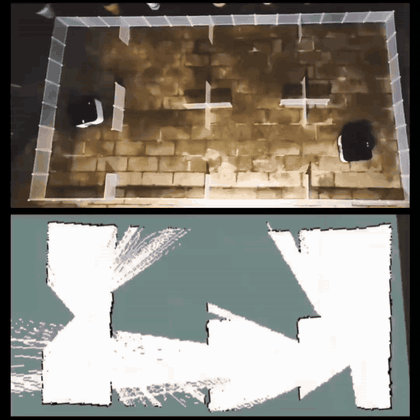
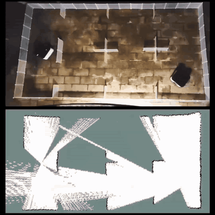
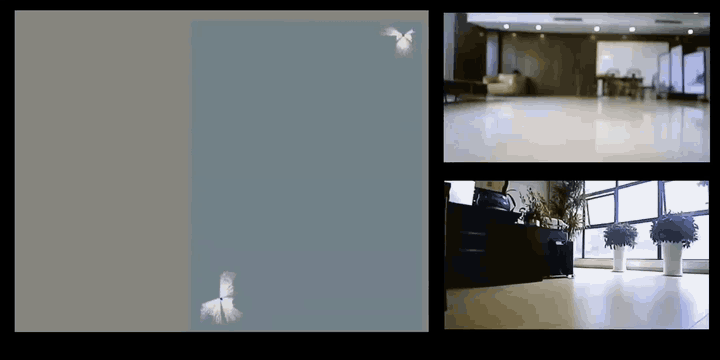
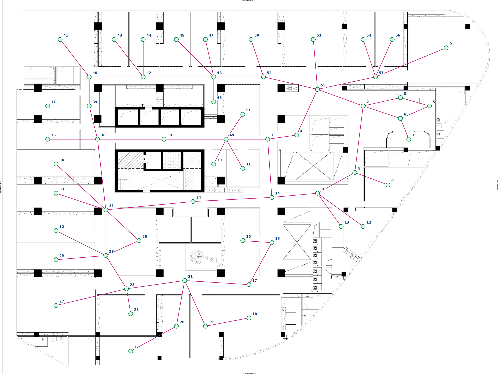

# Real-world demonstrations

The accompanying GEVD demo presentation contains a controlled small-scale
comparison and a larger office experiment. The clips below come directly from
its embedded videos. Click a GIF or the video link to open the full MP4.

## Small-scale physical experiment

Two mobile robots explore the partitioned arena. The upper view shows the
physical robots, and the lower view shows the evolving map. The presentation
labels the left clip **Coverage-only baseline** and the right clip **GEVD**.

| Coverage-only baseline | GEVD |
|---|---|
|  |  |
| [Full MP4, 11.9 s](assets/demos/small_coverage_only.mp4) | [Full MP4, 13.1 s](assets/demos/small_gevd.mp4) |

Both clips retain their own source timing and loop independently. Their different
lengths do not establish a runtime comparison. The [physical setup and structural-score
illustrations](experiments.md#small-scale-physical-setup) provide context for this arena.

## Large-scale physical experiment

GEVD explores the office environment shown below. The video combines the evolving
map and two colored robot trajectories on the left with two onboard camera views
on the right. The [full MP4](assets/demos/large_gevd.mp4) preserves the original
2160 x 1080 video for inspecting map and trajectory details.

### Environment topology

*The presentation supplies this office floor plan with regions labeled 0 through
57. It is a separate environment from the small seven-region arena. The figure
provides visual context; it does not specify executable metric coordinates,
calibrated edge costs, or the robot deployment configuration.*

## Media details

| Demonstration | Presentation source | Full clip | MP4 resolution | GIF preview |
|---|---|---:|---|---|
| Small-scale coverage-only baseline | Slide 7, left video | 11.87 s | 1080 x 1080, 30 fps | 420 x 420, 8 fps |
| Small-scale GEVD | Slide 7, right video | 13.10 s | 1080 x 1080, 30 fps | 420 x 420, 8 fps |
| Large-scale GEVD | Slide 9 | 43.57 s | 2160 x 1080, 30 fps | 720 x 360, 5 fps |

The office topology is the original embedded image from slide 6. Each MP4 retains
the complete original video stream, with audio and container metadata removed.
GIFs reduce resolution, frame rate, and color depth for inline viewing and do
not change the source playback speed. The source clips may already be edited
or accelerated; their relationship to elapsed experiment time is not established.

These videos demonstrate physical behavior and mapping qualitatively. They do
not provide raw sensor measurements or establish quantitative performance,
statistical significance, or sensor-level reproducibility. ROS recordings remain
outside this repository. See [data availability](reproducibility.md#physical-experiment)
for the scope of the released implementation and experiment evidence.
