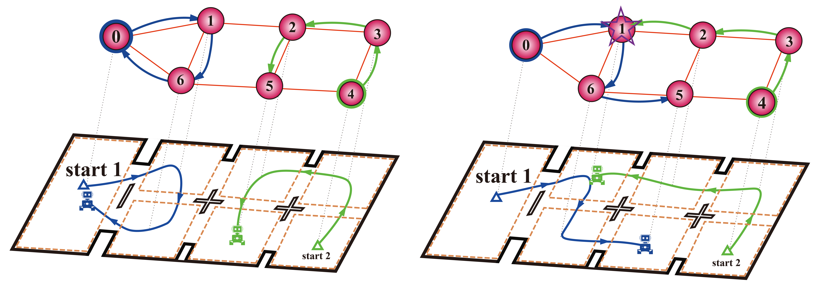
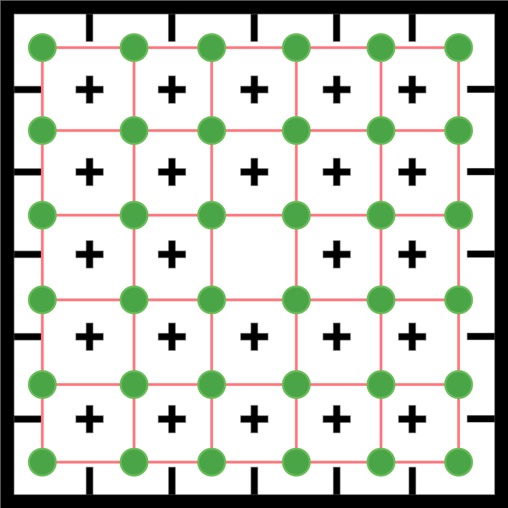
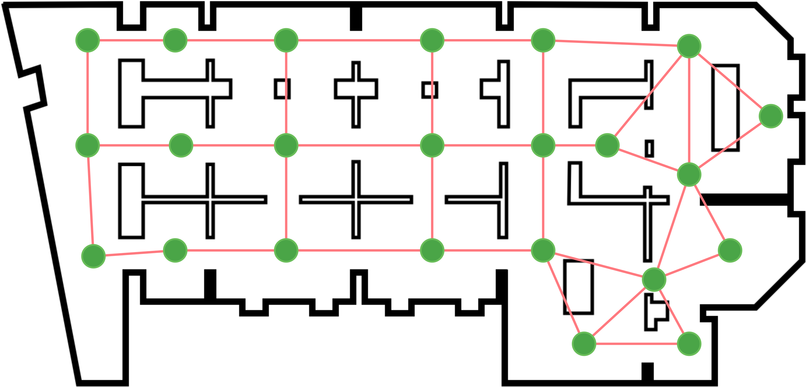
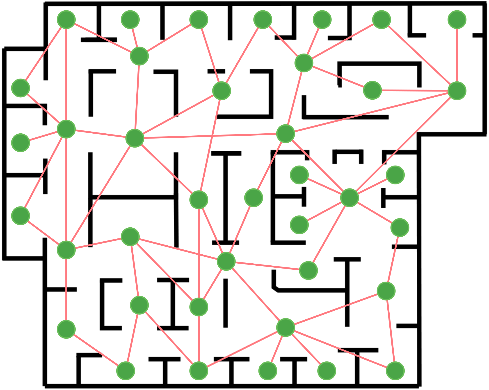
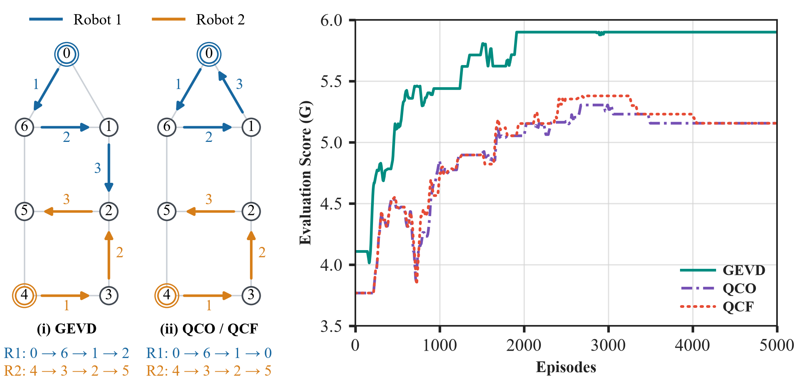
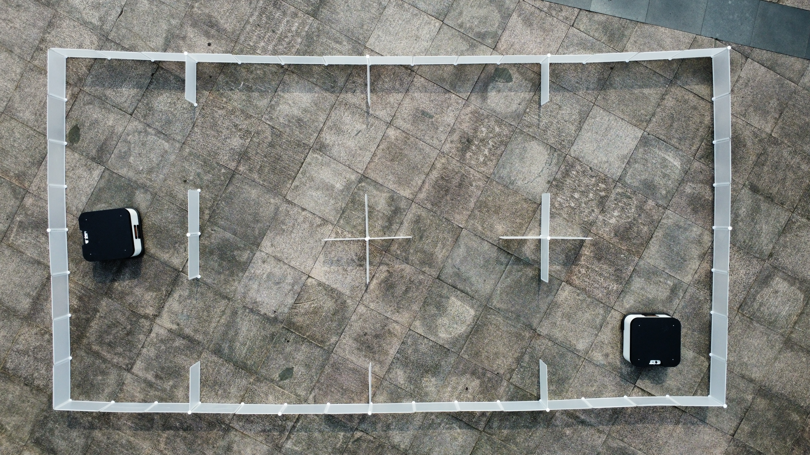
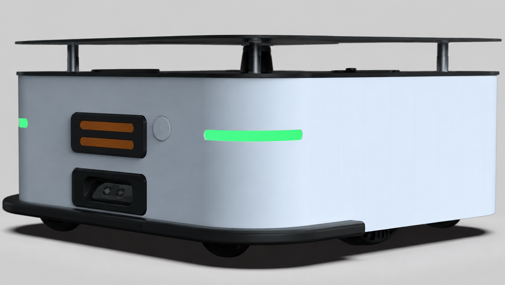
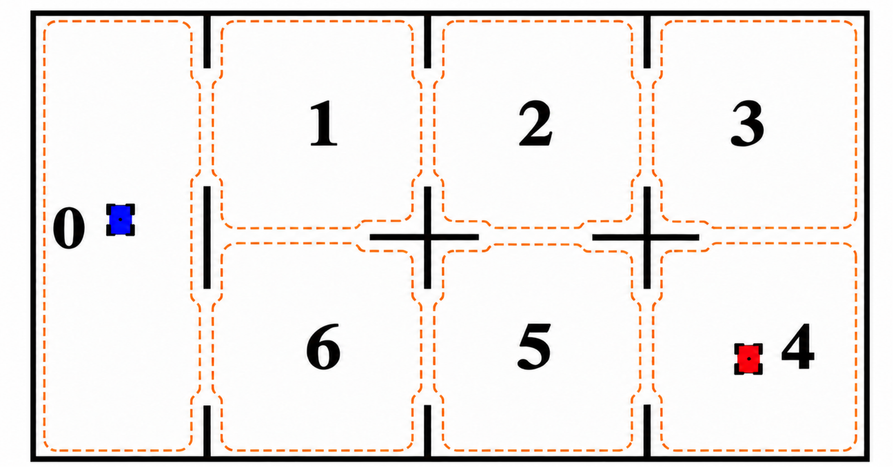
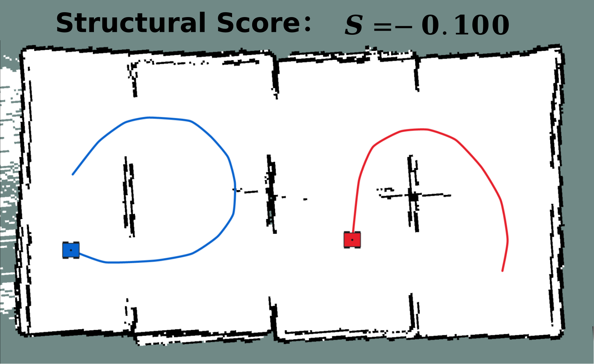
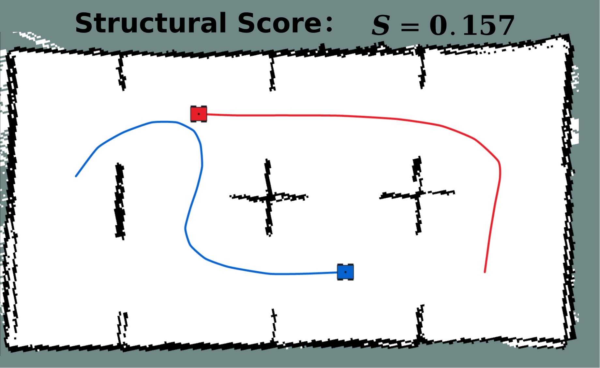

# Experiments and manuscript illustrations

The figures on this page were supplied with the manuscript. Raster originals are
preserved without redrawing; the method overview is rendered from the supplied
vector PDF. They illustrate the study and are not newly generated measurements.

## Cooperative mapping concept

*Region-level planning couples local exploration with opportunities for inter-robot
closure. The two panels illustrate different route choices in the same setting.*

## Simulation environments

| Manuscript environment | Code map | Regions | Robot counts | Horizons for 2 / 3 / 4 robots |
|---|---|---:|---|---|
| Environment 1 | `map3` | 36 | 2, 3, 4 | 23 / 17 / 13 |
| Environment 2 | `map7` | 23 | 2, 3, 4 | 14 / 11 / 9 |
| Environment 3 | `map8` | 39 | 2, 3, 4 | 35 / 23 / 18 |

| Environment 1 (`map3`) | Environment 2 (`map7`) | Environment 3 (`map8`) |
|---|---|---|
|  |  |  |

*Green markers denote graph regions and the overlaid connections define the
planning structure. The YAML files and graph assets specify the executable tasks;
the raster figures are illustrations.*

### Seven-node example

*The supplied figure contrasts the GEVD routes with coverage-oriented routes and
shows the manuscript learning-curve illustration. Its horizontal axis is labeled
Episodes. Available experiment logs use budgeted simulator-call coordinates, and
the exact mapping to this plotted axis has not been verified. This image is not a
claim of a newly reproduced curve or a multi-seed mean.*

The seven-node task uses two robots starting at regions 0 and 4, nine unit-length
edges, and a horizon of three joint steps. See [parameters](parameters.md) for the
fixed beta and the learner budgets.

## Single-run ablation example

The following compact display corresponds to the saved routes behind manuscript
Table II on map8 with three robots (seed 906305). It reports a retained verified
successful route, or a saved complete failure when no success was retained.
These are not multi-seed means or final-policy scores. See the
[reproducibility notes](reproducibility.md) for the selection rule.

| Method | G | S | Complete fused map |
|---|---:|---:|---|
| GEVD | 12.865 | 0.292 | Yes |
| Without retrospective utility | 12.601 | 0.317 | No |
| Without value decomposition | 12.859 | 0.286 | Yes |
| Without fusion reward | 12.807 | 0.236 | Yes |
| Raw structural score | 12.561 | 0.291 | No |

## Physical setup

| Experiment arena | Robot platform |
|---|---|
|  |  |

*Author-supplied photographs of the physical experiment and robot platform. The
portable release contains the high-level graph simulator; it does not include a
ROS navigation or sensor-processing deployment stack.*

*Seven-region abstraction: region 0 is the left passage; regions 1, 2, and 3 are
on the upper row, with regions 6, 5, and 4 below. The depicted starting regions
are 0 and 4. The image does not provide an executable metric topology or determine
T_max, beta, or map scale; unspecified configuration fields remain unspecified.*

### Structural-score comparison

| Separate exploration | Coordinated exploration |
|---|---|
|  |  |

*The supplied manuscript illustrations annotate S = -0.100 for the separate
routes and S = 0.157 for the coordinated routes. These are image annotations,
not scores recomputed from released sensor data. Physical recordings are held
separately and have not been replayed as part of this release.*

See [reproducibility and data availability](reproducibility.md) before interpreting
these illustrations as quantitative reproduction evidence.
